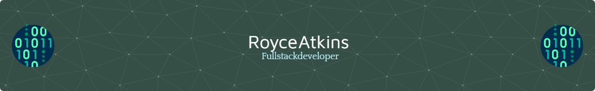

# Hi there, I'm Royce Atkins 👋

## 🚀 About Me

I'm a passionate Full Stack Web Developer with a knack for creating dynamic and responsive web applications. With a strong foundation in both front-end and back-end technologies, I love bringing ideas to life in the browser.

## 🛠️ Technologies & Tools

- **Front-end:** HTML5, CSS3, JavaScript, React
- **Back-end:** Node.js, Express.js
- **Database:** MySQL, PostgreSQL, MongoDB
- **Others:** Git, GitHub, Webpack, RESTful APIs, GraphQL

## 📈 GitHub Stats

## 🔗 Connect with Me

## 📚 Projects

### [Project 1:Vibra-Wood Guitars](https://github.com/Wartech93/Vibrawood_Guitars)
A fully functional e-commerce website built with React, Node.js, and MongoDB.

### [Project 2: D&D Spell Compendium](https://github.com/ParryProgramming/404_Project_2)
A tool for D&D players using a spell casting class in game.

### [Project 3: Portfolio Website](https://github.com/Wartech93/ThisisRoyce)
My personal portfolio website showcasing my skills and projects.

## 🌱 Currently Learning

- TypeScript
- Next.js
- Advanced AWS Solutions

## 🏆 Achievements

### EdX Bootcamp for Full Stack Flex Coding (June 2024)
- Comprehensive training in full stack development covering both front-end and back-end technologies.

---

⭐️ From [Royce Atkins]([https://github.com/yourusername](https://github.com/Wartech93))

Here is my Stack

 |              |            |                 |                 |
|              |         |               |                  |       |
|              |          |              |                  |                  |
|            |           |            |                     |                  |
